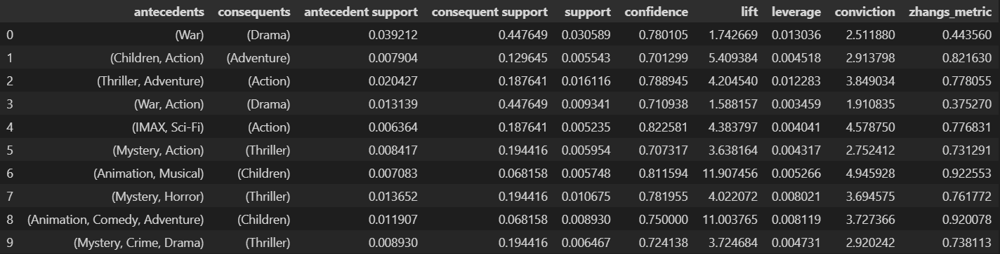

\newpage

# Executive Summary 
In this report we will analyze the association rules that can be derived from movies and their ratings. Specifically, we will test:

- are there associations between movie genres, 
- are there specific words in titles that can be associated with genres,
- are movies` ratings in any way associated with their genres, 
- are there any association of genres liked by users.\

Our experiments have proven that for all above assumptions association rules can be found.
 

The first experiment shows that association rules can be found where expected, e.g.\
**Mystery and Horror -> Thriller**.\
The second experiment depicts slightly less obvious information, that there are some specific words in titles that can be directly associated with genres, e.g.\
**love -> Romance**.\
The third experiment manifests important information regarding the film industry, where we can notice that specific genres of movies can be associated with an average rating above or below a given value, e.g.\
**Action -> Average rating worse than 3.5**.\
The last experiment reveals that there exist association rules between genres that specific users like together, e.g.\
**Adventure -> Action**.
 

We conclude that genres of movies that are similar in nature can be easily inferred from association rules, these rules are very closely related to the rules that present genres that are liked together. That means that people usually tend to like the same or only slightly different genres of movies, and do not rate movies outside of their usual choice.\
What is more, average rating of a movie inferred from association rules usually suggests that a given genre will receive a mark worse than 4.0, that is due to the fact that only the most popular genres were presented in the association rules, thus making the actually good films even more rare. That is because the more popular the genre is the more films are produced with given genre, and with quantity sadly the quality usually does not follow. That means that most films produced in popular genres are not really good and only a few big productions receive good ratings, meaning that the support of such grades is very low.\
Additionally, we have discovered a few words that are connected to specific movie genres, most of them are logical, but there are quite a few interesting inferences, such as that Comedy and action movies are most likely to receive a second part, as the association rules show that "2" or "II" is most oftenly found in titles related to these genres.

\newpage

# Introduction
This report is produced as an additional fix for the second assignment of the Data Mining course. We will try to find interesting association rules based on the movies and their ratings. Specifically, we will delve into the association between genres, whether the title words suggest some sort of genre, whether genre suggests some sort of grade, and what users usually like together. 

\newpage

# Methodology
To perform following experiments we have used a data set given at our laboratories that represent movies and ratings of them.

Additionally, to perform all necessary calculations we have used the following libraries in Python:

  + pandas - used to create data frames and perform transformations
  + numpy - used to perform more complex calculations more efficiently 
  + sklearn.preprocessing MultiLabelBinarizer - used to binarize the data frames
  + mlxtend.frequent_patterns apriori - used to apply the apriori algorithm 
  + mlxtend.frequent_patterns association_rules - used to create association rules
  + nltk.corpus stopwords - used to remove stopwords from titles

From the data set column timestamp is dropped as it will not be used in the experiments. What is more, for each genre a new column has been created, and each movie genres have been binarized into these columns. Additionally, English stopwords have been removed the titles of movies. Additional information has been added to the movies data frame that represents the ratings average value, and a new data frame was created to perform the last test that combines all users and the movies they liked.

\newpage

# Results & findings

## Test 1

### Are there associations between movie genres?

  {width=7in}

The following results were achieved by setting the minimum support to 0.005 and minimum confidence to 0.7.
 

We can see that the association rules represent movies which by humans are considered to be similar, or that are usually seen together. For example **Animation and Musical -> Children** greatly represents that most movies that are animated and contain musical elements usually are made for children. Or a rule **Mystery and Horror -> Thriller** represents the fact these rules not only show the associations, but similarity of the genres to each other. 

\newpage

## Test 2

### Are there specific words in titles that can be associated with genres?

  {width=7in}

The following results were achieved by setting the minimum support to 0.004 and minimum confidence to 0.4.
 

We can see that these association rules show that the words "love" or "man" are usually used in titles of movies in only specific genres such as **Drama** or **Romance**. We can also notice that only a few genres receive the same title, but with the number to represent the next part of the movie e.g. **2 -> Comedy** or **II -> Action**. Additionally, a common phenomenon in the Comedy movies industry can be noticed - we can oftenly see a word **movie** in the title, e.g. "Scary movie". 

\newpage

## Test 3

### Are movies` ratings in any way associated with their genres?

  {width=7in}

The following results were achieved by setting the minimum support to 0.1 and minimum confidence to 0.7.
 

We can see that these association rules show that most movies have some sort of an average rating over the genre close to 3.0, as most popular genres are better than 2.0, but usually worse than 4.0. There are two special cases - **Drama -> Average rating better than 3.0** meaning that drama movies are associated with slightly better rating than other movies, therefore confidence was high enough. The other special case **Action -> Average rating worse than 3.5**, which shows that though it is one of the most popular movie genres, the ratings are not as good as of other genres, and the amount of data to prove that was high enough to reach given confidence. That shows that with quantity of Action movies does not necessarily come quality. 

\newpage

## Test 4

### Are there any associations of genres liked by users?

  {width=7in}

The following results were achieved by setting the minimum support to 0.35 and minimum confidence to 0.75.
 

We can see that these association rules are relatively similar to the association rules discovered in the first experiment. That infers that people tend to like movies with genres similar to other liked genres. On the other hand there are a few "surprises", such as **Action and Adventure -> Drama**. That example represents genres which are not really similar to each other and did not appear in the first experiment, that means that given genres should be put together, as they are usually liked by the public, even though they are different from usual genres that given public likes to watch.  

\newpage

# Conclusions 
The association rules discovered by us provided us with additional knowledge about movie themes and their associations.
 

There were rules which were obvious and could be inferred without doing the experiments. These rules we have discovered in the first experiment, where similarity or affiliation between genres can be easily noticed. Not a lot of insight was also provided in the third experiment, where we tried to associate  the score to a movie genre. In reality we could only see, that on average each movie theme has a rating around 3, with only two exceptions being action movies that are the only ones that can be associated with rating lower than 3.5, and drama movies that could be associated with rating better than 3, as the only one. It implies that the amount of action movies made is large, thus making it harder for the association rule of better score is difficult to achieve. Contrary to that, drama movies are rarer and appear to have a better rating, making it easier for the association rule to appear. That proves that with quantity, quality tends to drop. 
 

Our experiments were also able to produce some surprising association rules in experiment 2 and 4, where we tested the titles` association to genres and the association between different genres liked by a single cinema goer. These rules, even though not apparent, had relatively high confidence and support, meaning that these rules truly have some endorsement in reality. With that knowledge, we have a different perspective on how the movie industry works, as it clearly follows association rules, even those which appeared to be surprising. With further analysis an example of **Action and Adventure -> Drama** proves to also be true and multiple movies can be found with such themes, which allows us to conclude that even some more complex associations are used in the film industry. **movie -> Comedy** or **II -> Action** were also rather unusual, but have clear reference in reality, as previously mentioned popular comedy "Scary movie" or a very popular action film "Terminator 2". 
 

To sum up, association rules are a great way to summarize and reflect reality in a useful and insightful way. With great parameters, interesting and useful association rules can be "mined", which can be used in countless companies/fields/economies. They allow to develop given field in a way most appropriate to the public's demand. 